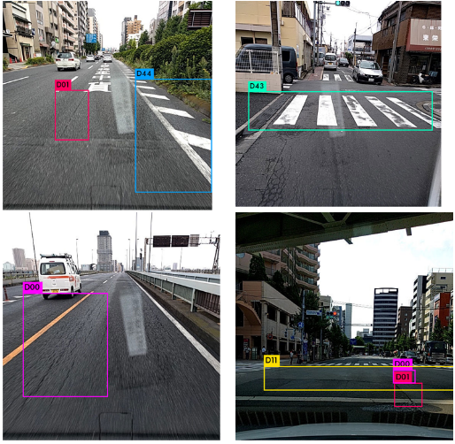
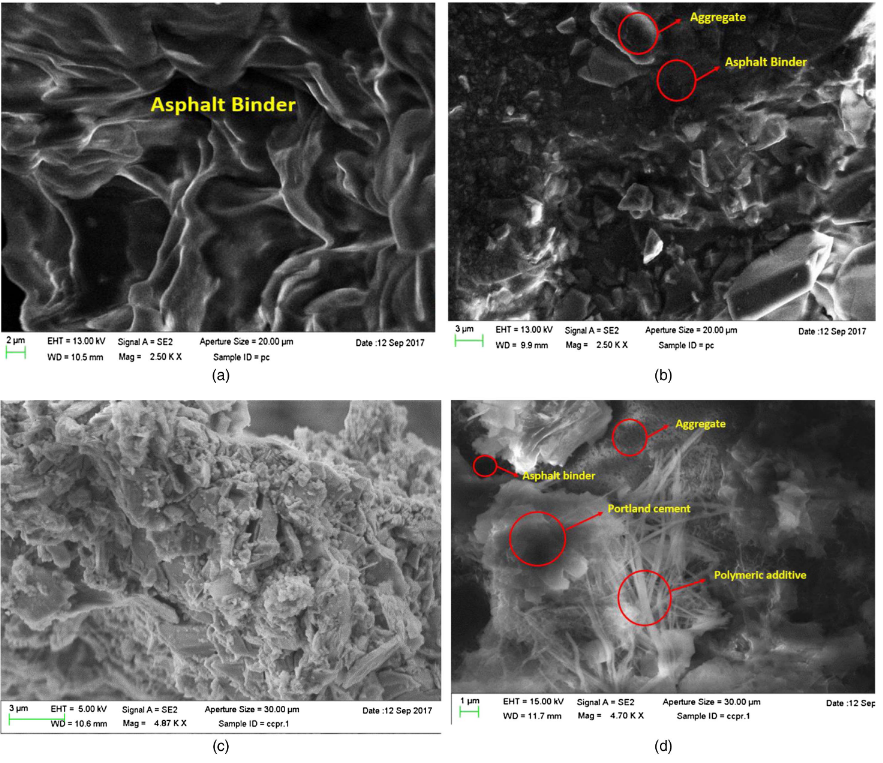

## Bio
My name is Masoud. I am a PhD student in Civil Engineering and interested in application of AI in Civil and Transportation Engineering. More specifically now I am involved with a project about using deep learning methods for road damage detection and segmentation. Main deep learning algorithms I am using in my reseach are YOLO (for objet detection) and UNET (for objectsegmentation). I like to learn data science because:

1. I am very inrterested in extracting intuition out of raw data.
2. I love to do research on intelligence from an engineering prospective. I found deep learning as the most promising method to follow this goal in my life. Not only as an important skill for my future profession, but also as my hobby.
3. I think it is very helpful to have this knowledge since, new technologies have led to exponential increase in the volum of gathered data. Huge raw data has potential super power which could be activated by application of data science.

---
### Education

- PhD- Engineering
- MS- Computer Science
- MS- Civil and Environmental Engineering

---
### Recent Projects

- [Road Damage Detection and Classification Using Deep NeuralNetworks with Smartphone Images](https://www.researchgate.net/publication/342179672_Road_Damage_Detection_and_Classification_Using_Deep_Neural_Networks_YOLOv4_with_Smartphone_Images)

- [Evaluation of Cold Recycled Asphalt Mixture Treated with Portland Cement as Base-Layer Materials ](https://ascelibrary.org/doi/abs/10.1061/(ASCE)MT.1943-5533.0003073)

---
### Work Experience
- Instructor and Research Assistant- University of Rhode Island
- Intern- U.S. Department of Transportation- Planning Division
- Intern- U.S. Department of Transportation- Materials Division

---

Page template forked from <a href="https://github.com/evanca/quick-portfolio">evanca</a>

<!-- Remove above link if you don't want to attibute -->
